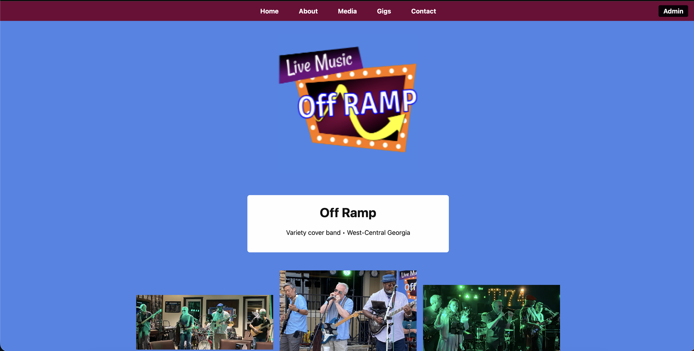

# Project & Portfolio

### Tiffany Seals


[Log](./docs/logs.md)

<br>

# Off Ramp Band Website

A full-stack web application for the Off Ramp Band that showcases their media, gigs, and allows users to submit booking requests.

---

## Table of Contents

- [Demo](#demo)
- [Features](#features)
- [Tech Stack](#tech-stack)
- [Installation](#installation)
- [Usage](#usage)
- [Folder Structure](#folder-structure)
- [License](#license)

---

## Demo

  

---

## Features

- Browse pictures and videos of the band
- View upcoming gigs with date and time
- Submit booking requests via contact form
- Responsive design for desktop and mobile
- Admin access to manage content (future feature)

---

## Tech Stack

- **Frontend:** React, Vite, React Router, CSS
- **Backend:** Node.js, Express, Nodemailer
- **Email:** Gmail SMTP for booking requests
- **Linting & Formatting:** ESLint (Airbnb Style Guide), Prettier
- **Other:** CORS, dotenv for environment variables

---

## Installation

1. Clone the repository:

    ```bash
    git clone https://github.com/DayTiffany-FS/2508-WDV349-SealsTiffany.git
    cd 2508-WDV349-SealsTiffany
    ```

2. Install dependencies for both client and server:

    ```bash
    # Frontend
    cd client
    npm install

    # Backend
    cd ../server
    npm install
    ```

3. Set up environment variables in `server/.env`:

    ```env
    GMAIL_USER=youremail@gmail.com
    GMAIL_PASS=your_app_password
    PORT=3000
    ```

4. Run the project:

    ```bash
    # Start backend
    cd server
    nodemon index.js

    # Start frontend
    cd ../client
    npm run dev
    ```